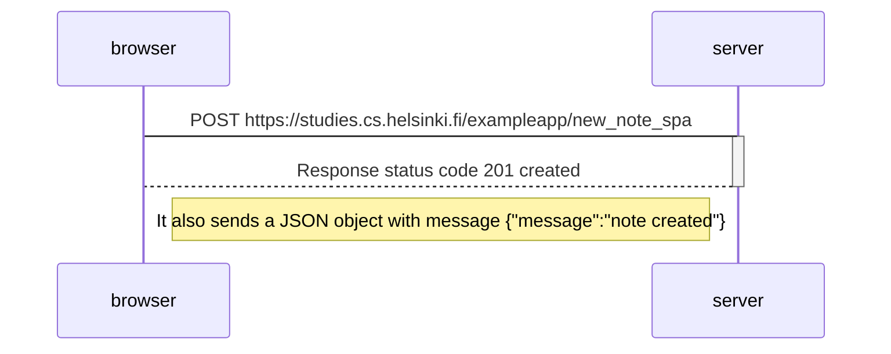

```mermaid
sequenceDiagram
    participant browser
    participant server

    browser->server: POST https://studies.cs.helsinki.fi/exampleapp/new_note_spa
    activate server
    server-->browser: Response status code 201 created
    deactivate server
    Note left of server: It also sends a JSON object with message {"message":"note created"}
```